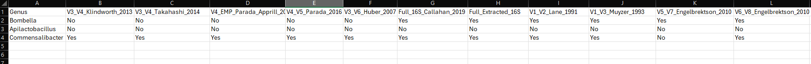
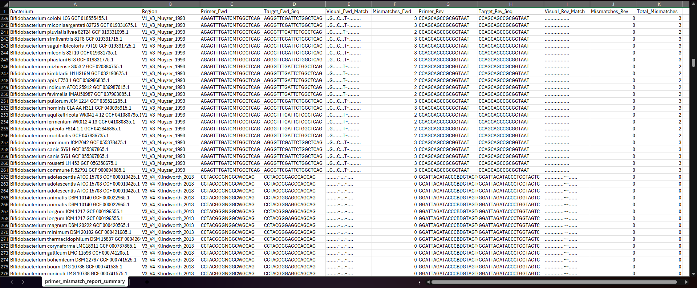
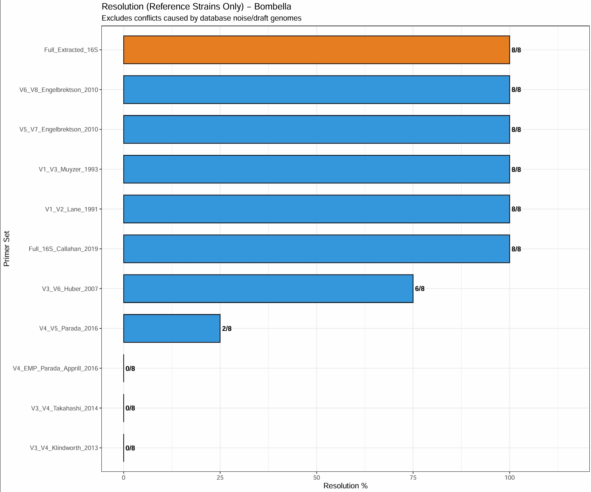
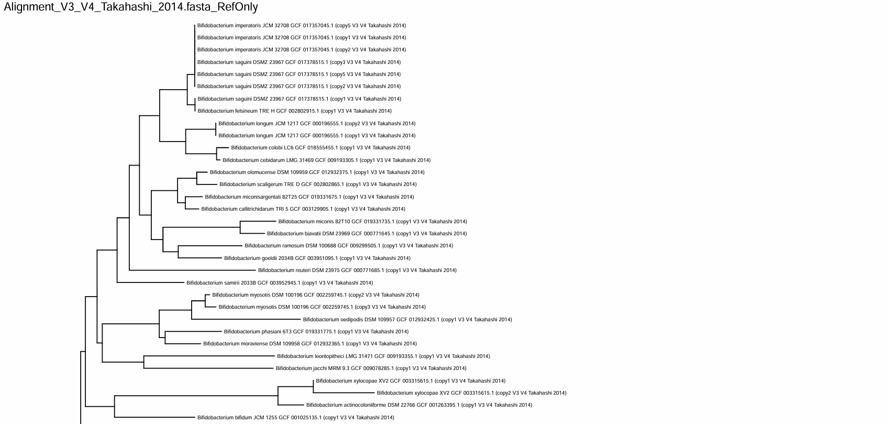
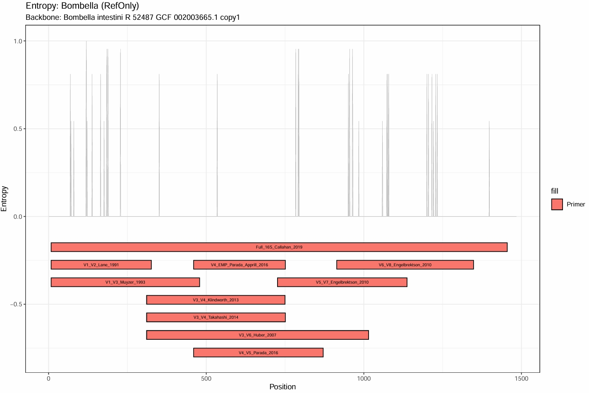

# rResolution16S
A Comprehensive 16S rRNA Gene Taxonomic Resolution Pipeline

rResolution16S is an automated R package designed to evaluate and optimize 16S rRNA gene primer selection for specific bacterial genera and determine the level of taxonomic resolution provided by a primer set for a given genera. By extracting full-length 16S rRNA sequences from high-quality NCBI RefSeq genomes and simulating in silico PCR across hypervariable regions, this pipeline generates empirical metrics on primer mismatch, phylogenetic resolution, and sequence entropy.

The Rationale: Why rResolution16S?
The 16S ribosomal RNA (rRNA) gene is the gold standard for bacterial taxonomic classification. However, next-generation sequencing (NGS) platforms typically rely on short-read amplicons spanning only one or two hypervariable regions (e.g., V3-V4, V4) rather than the full ~1,500 base pair gene (Bukin et al., 2019).

Relying on universal short-read amplicons presents two major challenges in microbiome research:

Variable Taxonomic Resolution: The phylogenetic signal of a specific hypervariable region is highly genus-dependent. A region that perfectly resolves species within one genus may completely fail to distinguish species in another (Johnson et al., 2019).

Primer Bias: "Universal" primers often contain mismatches against specific clades, leading to amplification bias, underrepresentation, or complete dropout of key taxa in metabarcoding datasets (Klindworth et al., 2013; Parada et al., 2016).

rResolution16S solves this by taking a targeted, data-driven approach. Before beginning library preparation or sequencing, researchers can use this package to objectively determine which primer set yields the highest species-level resolution for their specific taxa of interest, while quantifying and avoiding critical primer mismatches. Alternatively, with metabarcoded datasets, the genus level taxonomy can be fed into rResolution16S in order to determine which taxa can be confidently classified to the species level and which cannot.


The run_16s_pipeline() function executes a completely automated, multi-phase workflow:

Data Acquisition from NCBI -
The pipeline interfaces with the NCBI RefSeq database, downloading only complete genomes, chromosomes, and high-quality scaffolds for the targeted genera. RefSeq is prioritized to ensure that the baseline sequences are expertly curated and highly reliable (O'Leary et al., 2016).

Nomenclature Validation (LPSN) *optional -
Bacterial taxonomy is subject to frequent revisions. The pipeline integrates with the List of Prokaryotic names with Standing in Nomenclature (LPSN) to cross-reference genome identities. Genomes with synonymous, outdated, or "not validly published" names are flagged and/or filtered to ensure downstream phylogenetic trees reflect current taxonomic consensus (Parte et al., 2020).

Full-Length 16S Extraction & Dereplication -
Using the .gff genomic coordinate files, the package extracts all copies of the 16S rRNA gene from the downloaded genomes (.fasta files). Because bacteria frequently possess multiple, polymorphic copies of the 16S rRNA operon (Vetrovsky & Baldrian, 2013), the sequences are subsequently dereplicated to unique sequence hashes, preventing artificial over-representation in the alignments.

In Silico PCR & IUPAC Mismatch Logging -
Extracted sequences are aligned using MAFFT (Katoh & Standley, 2013) if a path is provided, but will default to DECIPHER (Wright, 2015). The package then simulates PCR amplification using standard primer sets (e.g., EMP V4, Klindworth V3-V4), or custom primer sets if provided. It utilizes the Biostrings package to perform character-by-character IUPAC-aware mismatch mapping, generating a detailed visual report of primer binding efficacy and identifying mismatched bases. A passing in silico PCR does not mean it will work in vivo; the package is set up to always perform the in silico PCR to obtain the resolution of the chosen genera, and the primer mismatch report should always be examined to determine if a primer is likely to work in vivo.

Phylogenetic Resolution & Entropy Mapping -
Extracted amplicons are converted into distance matrices to calculate the percentage of reference species perfectly resolved by each hypervariable region. Outputs include customized ggtree (Yu et al., 2017) phylogenetic visualizations, sequence entropy maps, and a simple primer resolution report providing visual confirmation of region suitability. A master summary file is also generated at the genera level to give a quick snapshot of the level of resolution for all genera inputed at the start of a run for each primer pair.

## Installation via GitHub
```r
#Install the remotes package if not already present
if (!requireNamespace("remotes", quietly = TRUE)) {
  install.packages("remotes")
}

#Install rResolution16S 
remotes::install_github("YourGitHubUsername/rResolution16S", quiet = TRUE)
```
(Note: Ensure MAFFT is installed on your system and accessible via your system PATH, though the package will fall back to DECIPHER if MAFFT is unavailable).

Quick Start Guide
Load the package and run the pipeline on a genus of interest. The function generates a robust folder structure containing all metadata, alignments, trees, and mismatch reports.

Because `rResolution16S` relies on powerful data manipulation and bioinformatics libraries, loading it standardly will print several warnings about masked dependency objects. To load the package silently, use `suppressPackageStartupMessages()`:

```r

suppressPackageStartupMessages(library(rResolution16S))

# Overview of standard options
run_16s_pipeline(
    target_genera = c("Genus1", "Genus2", "Genus3"), 
    output_dir = ".",
    mafft_path = "FILE_PATH_TO/mafft.bat",
    custom_primers = NULL,
    only_reference = TRUE,
    dereplicate_strains = TRUE,
    remove_unclassified = TRUE,
    enable_lpsn_check = TRUE,
    lpsn_db_path = "FILE_PATH_TO/lpsn_gss_2026-02-10.csv",
    max_contigs = 100,
    refseq_max_age = 30,
    keep_genomes = TRUE)
```

### Parameter Explanations

target_genera: Genera you wish to analyze (e.g., c("Bifidobacterium", "Snodgrassella")) or input a .csv file (target_genera = c("PATH_TO_FILE/genus_list_example.csv")) with a list of genera. See examples folder on GitHub for .csv input format 'genus_list_example.csv'.

output_dir: Path to the folder where results should be saved. Defaults to current working directory (working directory is where NCBI refseq_assembly_summary.txt is downloaded and where Master_Resolution_Summary.csv is generated). Each genera targeted generates a new folder in the output directory with all genus specific output files.

mafft_path: Path to MAFFT executable (default: "mafft"). If MAFFT is not found, the pipeline automatically falls back to DECIPHER. Set to "" to intentionally force DECIPHER and bypass the MAFFT system check.

custom_primers: Optional. Path to a CSV file or an R list containing custom primer sets. See examples folder on GitHub for .csv input format 'primer_list_example.csv'

only_reference: If TRUE, only uses RefSeq/Representative genomes. Some RefSeq/Representative genomes are not validly published according to LPSN, so enable that setting as well if wanting only validly published reference species. TRUE is recommended as many genera have a lot of poor quality genomes (sometimes even the reference genomes are bad unfortunately).

dereplicate_strains: Keep only the best genome per strain (based on lower contig/scaffold count).

remove_unclassified: Remove unclassified strains like "sp." or "indicum".

enable_lpsn_check: Validate names against LPSN database.

lpsn_db_path: Path to the LPSN database CSV file. Can be downloaded at https://lpsn.dsmz.de/downloads

max_contigs: Maximum allowed contigs/scaffolds for draft genomes. RefSeq representative genomes are always kept regardless of contig/scaffold #.

refseq_max_age: Maximum age (in days) of the local RefSeq summary file before a new one is downloaded. Set to Inf to always use the local file if it exists, or 0 to force a fresh download. Default is 30.

keep_genomes: If space is an issue set to FALSE to automatically delete .gff and .fasta folders after analysis is complete.

### Core Outputs

1. Master Resolution Summary
Master_Resolution_Summary.csv: A high-level overview of which primer sets achieved 100% species resolution. Includes all genera included in a single run of the script.


3. Primer Mismatch Map
primer_mismatch_report_summary.csv: A detailed, sequence-level visual map of primer alignments, highlighting critical mismatches (A, T, C, G), valid IUPAC flexibilities (~), and perfect matches (.).


4. Taxonomic Resolution Comparison
Strict_Resolution_Comparison_RefOnly.pdf: A bar chart comparing the taxonomic resolution power of each tested hypervariable region against the full-length 16S baseline. Some strains on NCBI are poorly sequenced, but this output will inform you about how many failed in silico PCR and which primer it was (forward or reverse - forward is always primer with the lower V#). It will also mention under the extracted 16S if there was a sequence with no extractable and useable 16S rRNA gene region.


5. Phylogenies & Alignments
Alignment_*.fasta & Tree_*.pdf: Multi-sequence alignments and corresponding phylogenetic trees for the full gene and every simulated amplicon.


6. Sequence Entropy Mapping
Entropy_Map_RefOnly/All.pdf: A visualization of the entropy of the 16S rRNA gene with primer amplicon regions shown for each primer pair.


### Secondary Outputs

extraction_status_report.csv: A table with information on the number of 16S rRNA genes extracted from each strain.

QC_Contig_Report.csv: A table with the number of contigs per strain and a Yes/No column if it passed the quality control setting assigned.

annotations/: A folder containing .gff files for all downloaded genomes.

genomes/: A folder containing all .fasta files for all downloaded genomes.

#### References

Bukin, Y. S., Galachyants, Y. P., Morozov, I. V., Bukin, S. V., Zakharenko, A. S., & Zemskaya, T. I. (2019). The effect of 16S rRNA region choice on bacterial community metabarcoding results. Scientific Data, 6(1), 190007.

Johnson, J. S., Spakowicz, D. J., Hong, B. Y., Petersen, L. M., Demircik, F., Cancio, C. C., ... & Weinstock, G. M. (2019). Evaluation of 16S rRNA gene sequencing for species and strain-level microbiome analysis. Nature Communications, 10(1), 5029.

Katoh, K., & Standley, D. M. (2013). MAFFT multiple sequence alignment software version 7: improvements in performance and usability. Molecular Biology and Evolution, 30(4), 772-780.

Klindworth, A., Pruesse, E., Schweer, T., Peplies, J., Quast, C., Horn, M., & Glöckner, F. O. (2013). Evaluation of general 16S ribosomal RNA gene PCR primers for classical and next-generation sequencing-based diversity studies. Nucleic Acids Research, 41(1), e1-e1.

O'Leary, N. A., Wright, M. W., Brister, J. R., Ciufo, S., Haddad, D., McVeigh, R., ... & Pruitt, K. D. (2016). Reference sequence (RefSeq) database at NCBI: current status, taxonomic expansion, and functional annotation. Nucleic Acids Research, 44(D1), D733-D745.

Pagès, H., Aboyoun, P., Gentleman, R., & DebRoy, S. (2024). Biostrings: Efficient manipulation of biological strings. R package version 2.70.1. Bioconductor. https://bioconductor.org/packages/Biostrings

Parada, A. E., Needham, D. M., & Fuhrman, J. A. (2016). Every base matters: assessing small subunit rRNA primers for marine microbiomes with mock communities, time series and global field samples. Environmental Microbiology, 18(5), 1403-1414.

Paradis, E., & Schliep, K. (2019). ape 5.0: an environment for modern phylogenetics and evolutionary analyses in R. Bioinformatics, 35(3), 526-528.

Parte, A. C., Sardà Carbasse, J., Meier-Kolthoff, J. P., Reimer, L. C., & Göker, M. (2020). List of Prokaryotic names with Standing in Nomenclature (LPSN) moves to the DSMZ. International Journal of Systematic and Evolutionary Microbiology, 70(11), 5607-5612.

Vetrovsky, T., & Baldrian, P. (2013). The variability of the 16S rRNA gene in bacterial genomes and its consequences for bacterial community analyses. PLoS One, 8(2), e57923.

Wickham, H. (2016). ggplot2: Elegant Graphics for Data Analysis. Springer-Verlag New York. https://ggplot2.tidyverse.org

Wickham, H., François, R., Henry, L., Müller, K., & Vaughan, D. (2023). dplyr: A Grammar of Data Manipulation. R package version 1.1.4. https://CRAN.R-project.org/package=dplyr

Wright, E. S. (2015). DECIPHER: harnessing local sequence context to improve protein multiple sequence alignment. BMC Bioinformatics, 16, 322. https://doi.org/10.1186/s12859-015-0749-z

Yu, G., Smith, D. K., Zhu, H., Guan, Y., & Lam, T. T. Y. (2017). ggtree: an R package for visualization and annotation of phylogenetic trees with their covariates and other associated data. Methods in Ecology and Evolution, 8(1), 28-36.

References for Built-in Default Primers
Lane_1991: Lane, D. J. (1991). "16S/23S rRNA sequencing." Nucleic acid techniques in bacterial systematics.

Muyzer_1993: Muyzer, G., et al. (1993). "Profiling of complex microbial populations by denaturing gradient gel electrophoresis analysis of polymerase chain reaction-amplified genes coding for 16S rRNA." AEM.

Klindworth_2013: Klindworth, A., et al. (2013). "Evaluation of general 16S ribosomal RNA gene PCR primers for classical and next-generation sequencing-based diversity studies." Nucleic Acids Research.

Takahashi_2014: Takahashi, S., et al. (2014). "A novel closed-tube method for calculating bacterial population sizes and comparing 16S rRNA gene amplicon sequencing data." PLoS One.

Huber_2007: Huber, J. A., et al. (2007). "Microbial population structures in the deep marine biosphere." Science. (Popularized the 341F/1061R combo for V3-V6).

Parada_Apprill_2016 / Parada_2016: Parada, A. E., et al. (2016). "Microbes across the water column... evaluation of updated 16S rRNA gene primers." Environmental Microbiology.

Engelbrektson_2010: Engelbrektson, A., et al. (2010). "Experimental evaluation of primer sets for 16S rRNA gene sequencing." ISME Journal.

Callahan_2019: Callahan, B. J., et al. (2019). "High-throughput amplicon sequencing of the full-length 16S rRNA gene with single-nucleotide resolution." Nucleic Acids Research. (Optimized the highly degenerate 27F/1492R combo for long-read sequencing).
