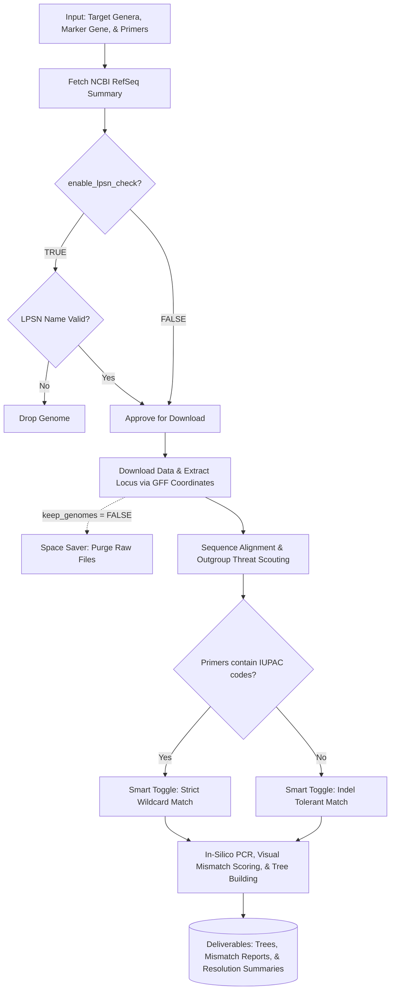

# MarkerCompass

**MarkerCompass:** An R framework for benchmarking marker genes and primer sets for taxonomic resolution.

`MarkerCompass` is a comprehensive, end-to-end R pipeline designed to evaluate the taxonomic and clade-level resolution of *in-silico* PCR primer sets. The tool automatically downloads target genomes from NCBI based on a list of genera, filters and dereplicates strains, parses `.gff` coordinates to isolate specific loci, runs an *in-silico* PCR extraction with an adaptive IUPAC-aware string matcher, and outputs publication-ready phylogenetic resolution metrics, trees, and high-fidelity primer mismatch reports.

---

## 🧠 The Rationale: Why MarkerCompass?

Targeted amplicon sequencing using marker genes (e.g., 16S rRNA, *rpoB*, *groL*, ITS) remains the gold standard for microbial taxonomic classification. However, high-throughput next-generation sequencing (NGS) platforms typically rely on short-read amplicons spanning only a fraction of the full-length gene (Bukin et al., 2019). 

Relying on "universal" short-read amplicons presents two major challenges in microbiome and evolutionary research:

1. **Variable Taxonomic Resolution:** The phylogenetic signal of a specific amplicon is highly lineage-dependent. A marker gene or sub-region that provides perfect species-level resolution for one taxonomic group may completely fail to differentiate closely related species in another (Johnson et al., 2019).
2. **Primer Bias & Clade Dropout:** "Universal" primers frequently contain sequence mismatches against specific clades. This leads to severe amplification bias, underrepresentation, or the complete dropout of key taxa in metabarcoding datasets (Klindworth et al., 2013; Parada et al., 2016).

`MarkerCompass` solves these challenges by taking a targeted, data-driven approach. Before beginning costly library preparations or sequencing runs, researchers can use this framework to objectively determine which marker gene and primer set will yield the highest taxonomic resolution for their specific clades of interest, while quantifying and avoiding critical primer mismatches. 

Alternatively, for already-sequenced metabarcoding datasets, researchers can feed their genus-level taxonomy back into `MarkerCompass` to definitively validate which taxa can be confidently classified down to the species level based on the utilized primer set, and which cannot.

---

## 📥 Installation

You can install the development version of `MarkerCompass` directly from GitHub using the `remotes` package. All required CRAN and Bioconductor dependencies will be installed automatically.

```R
# Install the remotes package if not already present
if (!requireNamespace("remotes", quietly = TRUE)) {
  install.packages("remotes")
}

# Install MarkerCompass
remotes::install_github("dybrettin/MarkerCompass", quiet = TRUE)
```

*(Note: For optimal alignment speed, ensure MAFFT is installed on your system and accessible via your system PATH. The package will automatically fall back to the native `DECIPHER` alignment engine if MAFFT is unavailable).*

---

## 🚀 Quick Start & Usage Guide

Once installed, running the pipeline requires only a single function call: `run_marker_pipeline()`.

Here is a basic usage example targeting the 16S rRNA gene for two specific genera. By default, this will run the built-in library of universal 16S primers.

```R
library(MarkerCompass)

run_marker_pipeline(
  target_genera = c("Gilliamella", "Snodgrassella"),
  output_dir = "MarkerCompass_Results",   # Where your output folders will be saved
  db_dir = "Database_Files",              # Where NCBI/LPSN masters are cached
  target_gene = "16S",                    # The gene to extract
  feature_type = "rRNA",                  # The feature type to filter by in the GFF
  enable_lpsn_check = TRUE,               # Validates against LPSN
  lpsn_db_path = "Database_Files/lpsn_gss.csv"
)
```

**Running Custom Primers:**
If you are running a different marker gene (e.g., *groL*) or want to test your own primers, simply pass a `.csv` file to the `custom_primers` argument:
```R
run_marker_pipeline(
  target_genera = "Neisseria",
  target_gene = "groL",
  feature_type = "gene",
  custom_primers = "path/to/my_groL_primers.csv"
)
```

---

## 🗺️ Pipeline Workflow



---

## ⚙️ Core Mechanics & Features

* **Universal Marker Gene Targeting:** By adjusting the target gene and feature type parameters, you can extract and assess primers for any annotated gene in the NCBI database, not just 16S rRNA.
* **"Smart Toggle" for Degenerate Primers:** Handling environmental primers with multiple `N`, `R`, `Y`, or `M` bases can be difficult due to how sequence mismatching handles insertions/deletions. The pipeline features a Smart Toggle that scans your input primers. If a primer consists entirely of standard bases (A, C, G, T), the script uses indel tolerance. If it detects *any* IUPAC ambiguity codes, it seamlessly switches to strict wildcard matching, preventing false-negative extraction failures on highly degenerate primers.
* **Pre-Flight LPSN Gatekeeping:** Many genomes on NCBI feature outdated, synonymous, or invalidly published species names. The pipeline cross-references the LPSN (List of Prokaryotic names with Standing in Nomenclature) database *before* downloading genomes. Invalid species lose their reference status and are subjected to strict fragmentation checks or dropped entirely, saving bandwidth and preventing taxonomic confusion.
* **High-Fidelity Mismatch Reporting:** The mismatch report generates a visual string alignment (e.g., `AT~~~~..~AA~..~.T~.A~TT~GG`) to help troubleshoot primer failures. Exact amplicon coordinate extraction prevents the aligner from clipping the edges of sequences, and true wildcard scoring ensures that degenerate bases that successfully match their target (e.g., an `N` matching an `A`) are visually scored with a tilde (`~`) rather than a hard mismatch.

---

## 🛠️ Configuration & Adjustable Parameters

The `run_marker_pipeline()` function accepts a variety of parameters to fine-tune your analysis. They are grouped below by their functional role.

### Input, Output & Infrastructure
* **`target_genera`**: A character vector of target genera (e.g., `c("Gilliamella", "Snodgrassella")`) or a string path to a `.csv` file containing a list of genera to process sequentially.
* **`custom_primers`**: Path to a `.csv` file containing custom primer pairs. If left as `NULL`, the script defaults to a built-in list of common 16S rRNA primer sets.
* **`output_dir`**: Path to the folder where results should be saved. Each targeted genus generates a dedicated subfolder here. *(Default: `"."`)*
* **`db_dir`**: Path to the directory where master databases (NCBI summary, LPSN) are stored. Setting this to a static folder prevents the pipeline from re-downloading massive databases for every new run. *(Default: `"."`)*
* **`lpsn_db_path`**: Path to your local LPSN database CSV file. *(Default: `"lpsn_gss.csv"`)*
* **`mafft_path`**: Path to your local MAFFT executable. If MAFFT is not found, the pipeline automatically falls back to the native R DECIPHER package. *(Default: `"mafft"`)*

### Gene Targeting
* **`target_gene`**: The specific gene text to search for in the `.gff` file. *(Default: `"16S"`)*
* **`feature_type`**: The feature category to filter by (e.g., `"rRNA"`, `"CDS"`, `"gene"`). This is critical because a term like "16S" might appear in multiple feature types, but you generally only want the `"rRNA"` one. Set to `"ANY"` to bypass. *(Default: `"rRNA"`)*

### Quality Control & Taxonomy
* **`enable_lpsn_check`**: **(Highly Recommended)** Validates species names against the LPSN database to flag synonyms and invalidly published names. *(Default: `TRUE`)*
* **`only_reference`**: Restricts the pipeline to only use RefSeq Reference or Representative genomes, filtering out lower-quality submissions. *(Default: `TRUE`)*
* **`dereplicate_strains`**: Keeps only the highest-quality genome per strain label to prevent clonal overrepresentation in your alignments and trees. *(Default: `TRUE`)*
* **`remove_unclassified`**: Automatically drops strains with ambiguous names like "sp.", "uncultured", or "Candidatus". *(Default: `TRUE`)*
* **`max_contigs`**: The maximum allowed number of contigs for draft genomes. True RefSeq Reference genomes bypass this limit. *(Default: `100`)*
* **`max_tax_level`**: The highest taxonomic tier to assess for clade resolution (e.g., `"Genus"`, `"Family"`, `"Order"`). *Warning: Higher levels require exponentially more compute time and bandwidth.* *(Default: `"Genus"`)*

### Execution & Resource Management
* **`n_threats`**: The number of closest outgroup genera to pull full species data for and align against your target. *(Default: `2`)*
* **`max_scout_genera`**: The maximum number of outgroup genera to fetch during the phylogenetic scout phase. Set to `Inf` for unlimited. *(Default: `50`)*
* **`refseq_max_age`**: Maximum age (in days) of your local RefSeq summary file before the script forces a fresh download from NCBI. Set to `Inf` to never redownload, or `0` to force a fresh download every time. *(Default: `30`)*
* **`keep_genomes`**: If `FALSE`, operates as a "Space Saver" and immediately deletes the `.fna` and `.gff` files from your hard drive after extracting the amplicons. *(Default: `TRUE`)*

---

## 🧬 Custom Primer CSV Format

If supplying your own primers via the `custom_primers` parameter, your `.csv` file must have the following exact headers:

| Primer_Name | Fwd_Seq | Rev_Seq | Min_Length | Max_Length |
| :--- | :--- | :--- | :--- | :--- |
| rpoB_Universal | CARTTYATGGAYCANNNNNAAYCC | CNGCYTGDCKYTKCATRTTNNNNNCCCAT | 300 | 700 |
| groL_H279 | GATNNNGCAGGNGATGGAACMACNAC | TGRTTNTCNCCAAAACCAGGNGCATT | 450 | 650 |

> **Length Bounds Note:** The pipeline uses `Min_Length` and `Max_Length` filters to discard off-target or truncated fragments. Ensure your maximum limits are sized generously enough to contain unexpected natural biological insertions.


### Core Outputs

1. Master Resolution Summary
Master_Resolution_Summary.csv: A high-level overview of which primer sets achieved 100% species resolution. Includes all genera included in a single run of the script.


3. Primer Mismatch Map
primer_mismatch_report_summary.csv: A detailed, sequence-level visual map of primer alignments, highlighting critical mismatches (A, T, C, G), valid IUPAC flexibilities (~), and perfect matches (.).


4. Taxonomic Resolution Comparison
Strict_Resolution_Comparison_RefOnly.pdf: A bar chart comparing the taxonomic resolution power of each tested hypervariable region against the full-length 16S baseline. Some strains on NCBI are poorly sequenced, but this output will inform you about how many failed in silico PCR and which primer it was (forward or reverse - forward is always primer with the lower V#). It will also mention under the extracted 16S if there was a sequence with no extractable and useable 16S rRNA gene region.


5. Phylogenies & Alignments
Alignment_*.fasta & Tree_*.pdf: Multi-sequence alignments and corresponding phylogenetic trees for the full gene and every simulated amplicon.


6. Sequence Entropy Mapping
Entropy_Map_RefOnly/All.pdf: A visualization of the entropy of the 16S rRNA gene with primer amplicon regions shown for each primer pair.


### Secondary Outputs

extraction_status_report.csv: A table with information on the number of 16S rRNA genes extracted from each strain.

QC_Contig_Report.csv: A table with the number of contigs per strain and a Yes/No column if it passed the quality control setting assigned.

annotations/: A folder containing .gff files for all downloaded genomes.

genomes/: A folder containing all .fasta files for all downloaded genomes.

#### References

Bukin, Y. S., Galachyants, Y. P., Morozov, I. V., Bukin, S. V., Zakharenko, A. S., & Zemskaya, T. I. (2019). The effect of 16S rRNA region choice on bacterial community metabarcoding results. Scientific Data, 6(1), 190007.

Johnson, J. S., Spakowicz, D. J., Hong, B. Y., Petersen, L. M., Demircik, F., Cancio, C. C., ... & Weinstock, G. M. (2019). Evaluation of 16S rRNA gene sequencing for species and strain-level microbiome analysis. Nature Communications, 10(1), 5029.

Katoh, K., & Standley, D. M. (2013). MAFFT multiple sequence alignment software version 7: improvements in performance and usability. Molecular Biology and Evolution, 30(4), 772-780.

Klindworth, A., Pruesse, E., Schweer, T., Peplies, J., Quast, C., Horn, M., & Glöckner, F. O. (2013). Evaluation of general 16S ribosomal RNA gene PCR primers for classical and next-generation sequencing-based diversity studies. Nucleic Acids Research, 41(1), e1-e1.

O'Leary, N. A., Wright, M. W., Brister, J. R., Ciufo, S., Haddad, D., McVeigh, R., ... & Pruitt, K. D. (2016). Reference sequence (RefSeq) database at NCBI: current status, taxonomic expansion, and functional annotation. Nucleic Acids Research, 44(D1), D733-D745.

Pagès, H., Aboyoun, P., Gentleman, R., & DebRoy, S. (2024). Biostrings: Efficient manipulation of biological strings. R package version 2.70.1. Bioconductor. https://bioconductor.org/packages/Biostrings

Parada, A. E., Needham, D. M., & Fuhrman, J. A. (2016). Every base matters: assessing small subunit rRNA primers for marine microbiomes with mock communities, time series and global field samples. Environmental Microbiology, 18(5), 1403-1414.

Paradis, E., & Schliep, K. (2019). ape 5.0: an environment for modern phylogenetics and evolutionary analyses in R. Bioinformatics, 35(3), 526-528.

Parte, A. C., Sardà Carbasse, J., Meier-Kolthoff, J. P., Reimer, L. C., & Göker, M. (2020). List of Prokaryotic names with Standing in Nomenclature (LPSN) moves to the DSMZ. International Journal of Systematic and Evolutionary Microbiology, 70(11), 5607-5612.

Vetrovsky, T., & Baldrian, P. (2013). The variability of the 16S rRNA gene in bacterial genomes and its consequences for bacterial community analyses. PLoS One, 8(2), e57923.

Wickham, H. (2016). ggplot2: Elegant Graphics for Data Analysis. Springer-Verlag New York. https://ggplot2.tidyverse.org

Wickham, H., François, R., Henry, L., Müller, K., & Vaughan, D. (2023). dplyr: A Grammar of Data Manipulation. R package version 1.1.4. https://CRAN.R-project.org/package=dplyr

Wright, E. S. (2015). DECIPHER: harnessing local sequence context to improve protein multiple sequence alignment. BMC Bioinformatics, 16, 322. https://doi.org/10.1186/s12859-015-0749-z

Yu, G., Smith, D. K., Zhu, H., Guan, Y., & Lam, T. T. Y. (2017). ggtree: an R package for visualization and annotation of phylogenetic trees with their covariates and other associated data. Methods in Ecology and Evolution, 8(1), 28-36.

References for Built-in Default Primers
Lane_1991: Lane, D. J. (1991). "16S/23S rRNA sequencing." Nucleic acid techniques in bacterial systematics.

Muyzer_1993: Muyzer, G., et al. (1993). "Profiling of complex microbial populations by denaturing gradient gel electrophoresis analysis of polymerase chain reaction-amplified genes coding for 16S rRNA." AEM.

Klindworth_2013: Klindworth, A., et al. (2013). "Evaluation of general 16S ribosomal RNA gene PCR primers for classical and next-generation sequencing-based diversity studies." Nucleic Acids Research.

Takahashi_2014: Takahashi, S., et al. (2014). "A novel closed-tube method for calculating bacterial population sizes and comparing 16S rRNA gene amplicon sequencing data." PLoS One.

Huber_2007: Huber, J. A., et al. (2007). "Microbial population structures in the deep marine biosphere." Science. (Popularized the 341F/1061R combo for V3-V6).

Parada_Apprill_2016 / Parada_2016: Parada, A. E., et al. (2016). "Microbes across the water column... evaluation of updated 16S rRNA gene primers." Environmental Microbiology.

Engelbrektson_2010: Engelbrektson, A., et al. (2010). "Experimental evaluation of primer sets for 16S rRNA gene sequencing." ISME Journal.

Callahan_2019: Callahan, B. J., et al. (2019). "High-throughput amplicon sequencing of the full-length 16S rRNA gene with single-nucleotide resolution." Nucleic Acids Research. (Optimized the highly degenerate 27F/1492R combo for long-read sequencing).
